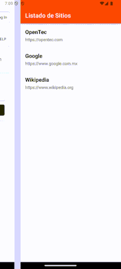

# 🌐 Listado de Sitios Web con WebView + API .NET



## 📱 Descripción del Proyecto

Sistema completo que consta de:

- **Aplicación móvil (React Native/Expo)** que muestra sitios web.
- **API REST (.NET 8)** que provee los datos.

## 🛠 Tecnologías Utilizadas

### Frontend Mobile
- React Native (Expo SDK)
- TypeScript
- React Navigation
- React Native WebView

### Backend API
- .NET 8
- ASP.NET Core Web API
- Swagger para documentación

## 🚀 Ejecución del Sistema

### API Backend (.NET)
```bash
cd API
dotnet run
```
Endpoints disponibles:

- `GET http://localhost:5053/api/websites`
- Swagger UI: `http://localhost:5053/swagger`

### Aplicación Mobile (Expo)
```bash
cd websitelist-app
npx expo start
```

## 📂 Estructura de Archivos

### Backend API
```
/API
├── Controllers/
│   └── WebsitesController.cs
├── Properties/
├── Program.cs
└── API.csproj
```

### Frontend Mobile
```
/src
├── components/
│   └── WebsiteItem.tsx
├── screens/
│   ├── HomeScreen.tsx
│   └── WebViewScreen.tsx
├── types/
├── App.tsx
└── config.ts
```

## 🔄 Flujo de Datos

La app móvil hace GET a `http://localhost:5053/api/websites`

La API responde con JSON de sitios web:

```json
[
  {
    "id": 1,
    "title": "OpenTec",
    "url": "https://opentec.com"
  }
]
```

La app muestra los datos y permite navegar a cada sitio.

## 📱 Funcionalidades Principales

### Aplicación Móvil
- Listado de sitios web
- Visualización en WebView integrado
- Navegación entre pantallas
- Soporte para Android/iOS

### API Backend
- Endpoint GET `/api/websites`
- Datos estáticos en formato JSON
- Documentación automática con Swagger

